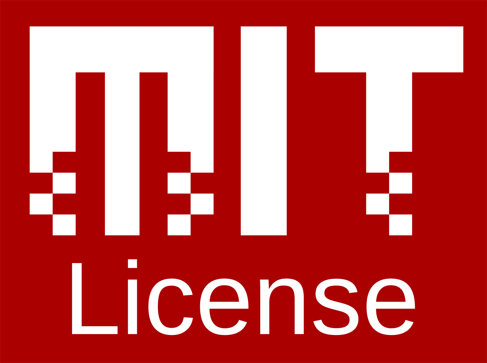

# Maya Operating System

Maya is an x86-64 operating system intended to run on real hardware. Just a hobby project of mine atm, doesn't have any real focus on being anything more than a hobby project.

## Building

Just run `make` in the root of the repo to build the full output disk image.

## Running

To run the build of the OS in QEMU for emulation purposes. Run `make run` in the root of the repo (standard BIOS) and `make run-uefi` for UEFI emulation.

### Real Hardware

Any old way of flashing the output hard disk image to an external drive or hard drive of sorts is suitable for use on real hardware. (Serial output will be disabled due to the lack of serial ports in most systems), using an initramfs (when implemented) is a better idea especially for running off things like an ISO to get a full runtime without flashing a full disk image.

## License

Maya is licensed under the [MIT](https://opensource.org/licenses/MIT) license. As such the code is free to use in commercial, private and public use as long as credit and the original MIT license is preserved.
